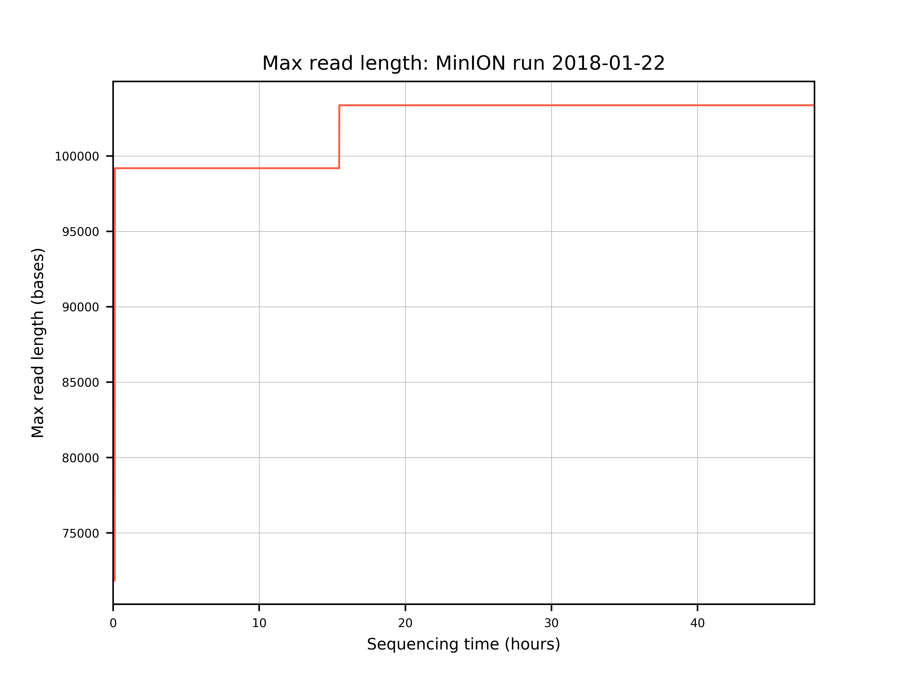
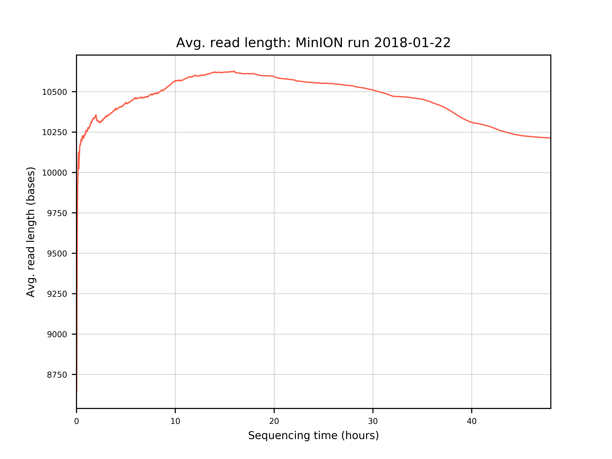
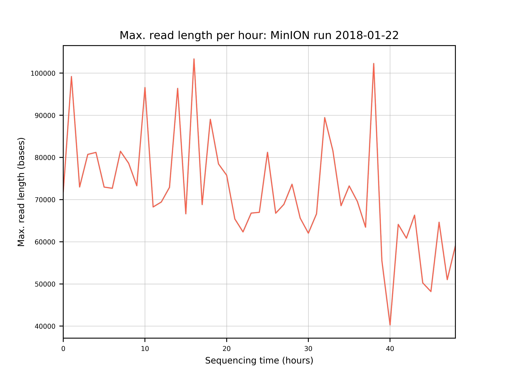
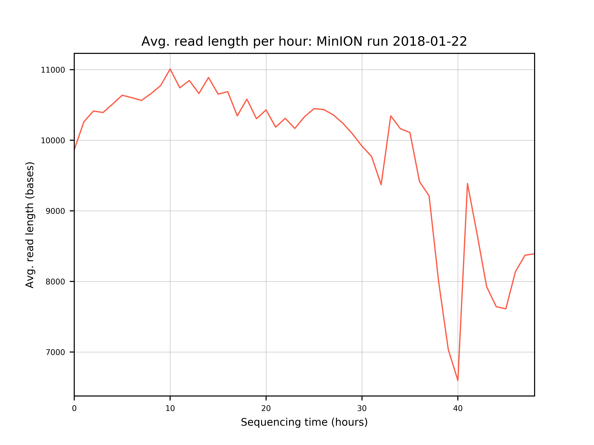

# plot-nanopore-run
Generates plots reporting on nanopore runs

## Requirements

1. Python 2.7
2. matplotlib 2.0.0 + dependencies

## Installation

```bash
git clone https://github.com/jopineda/plot-nanopore-run.git
virtualenv plot-nanopore-run-venv
# check setuptools installed
pip list
# set up matplotlib
python setup.py install
```

## General usage

```
usage: plot_nanopore_run.py [-h] -s/--summary SEQ_SUMMARIES [SEQ_SUMMARIES ...] [-o/--output OUTPUT_PREFIX]
                -r/--run_id RUN_ID

Calculate nanopore run report

arguments:
  -h, --help            show this help message and exit
  -s SEQ_SUMMARIES [SEQ_SUMMARIES ...], --summary SEQ_SUMMARIES [SEQ_SUMMARIES ...]
                        sequencing summary tab-separated file(s)
  -o OUTPUT_PREFIX, --output OUTPUT_PREFIX
                        prefix of output directory (Default: ./nanopore_run_report)
  -r RUN_ID, --run_id RUN_ID
                        run id will be displayed as part of titles of plots.
                        NOTE: wrap in quotes if spaces included.
```

### Input

Example sequence summary file:

```
filename                        read_id    run_id      channel start_time    duration    num_events    passes_filtering    template_start    num_events_template    template_duration    num_called_template    sequence_length_template    mean_qscore_template    strand_score_template    calibration_strand_genome_template    calibration_strand_identity_template    calibration_strand_accuracy_template    aligned_speed_bps_template
read_1_ch_1531_strand.fast5     read_id_1  run_id_1    1531    6548.61575    1.11875      895    False    0.0    895    1.11875    895    443    5.091    -0.0013    filtered_out    -1.0    -1.0    0.0
read_2_ch1223_strand.fast5      read_id_2  run_id_1    1531    6545.75575    1.14         912    False    0.0    912    1.14       912    511    4.7      -0.0012    filtered_out    -1.0    -1.0    0.0
```

### Output 

The script will produce plots for the following and save as png files in a directory with `--output` name:
1. Total yield as a function of sequencing time
2. Maximum read length as a function of cumulative sequencing time
3. Average read length as a function of cumulative sequencing time
4. Maximum read length per hour
5. Average read length per hour

It will also produce a PDF with all these plots.

## Example usage

```
python plot_nanopore_run.py -s [/path/to/sequencing_summary_batch0.txt] [/path/to/sequencing_summary_batch1.txt] -r "MinION run 2018-01-22" -o mion_run
```

### Example output









